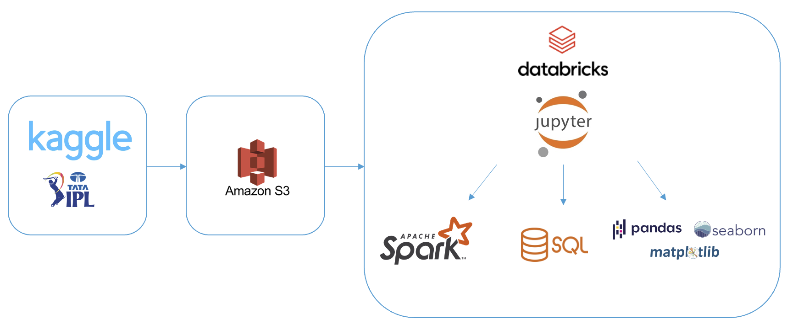
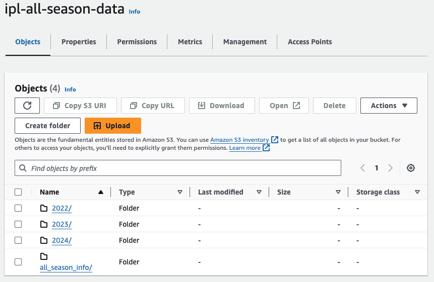
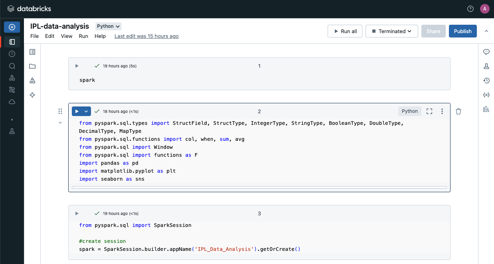
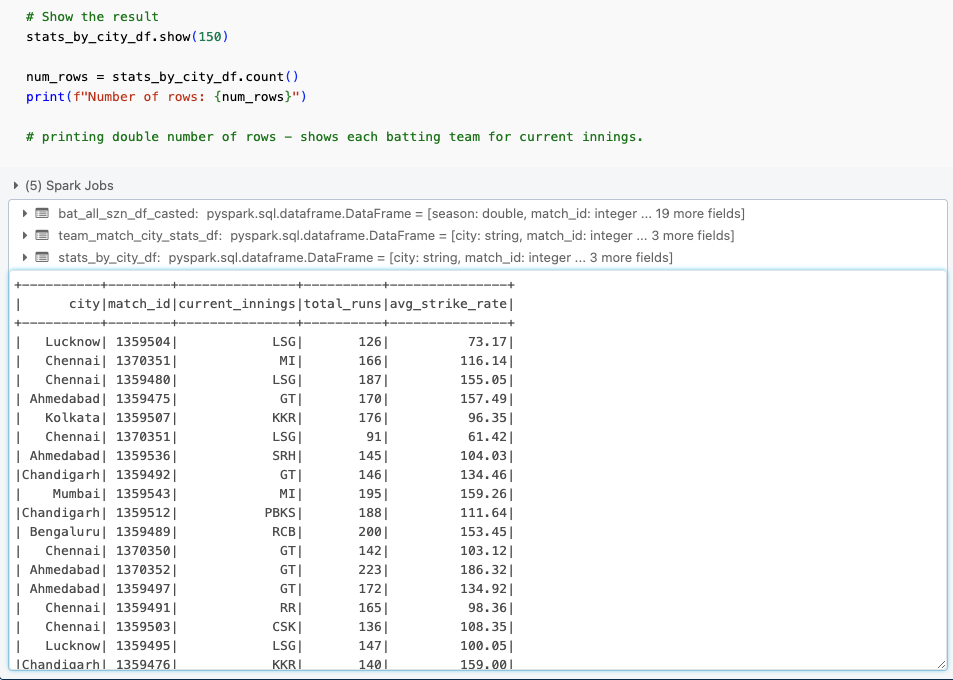
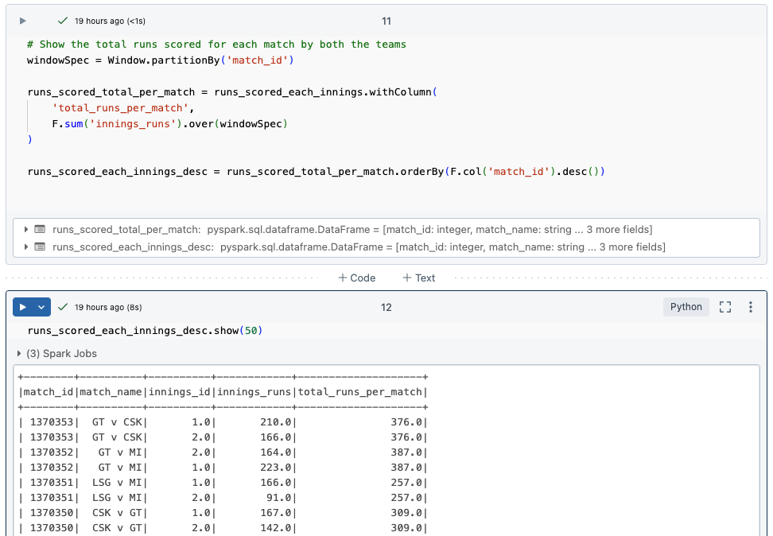
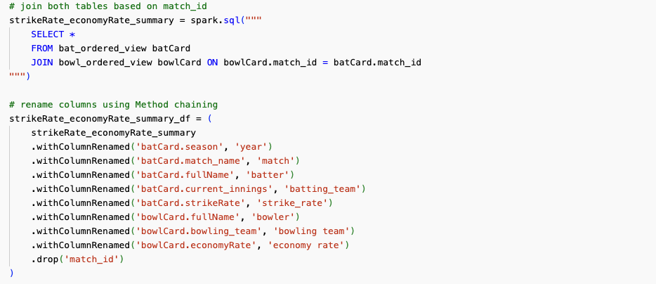
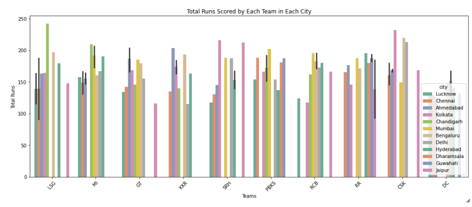
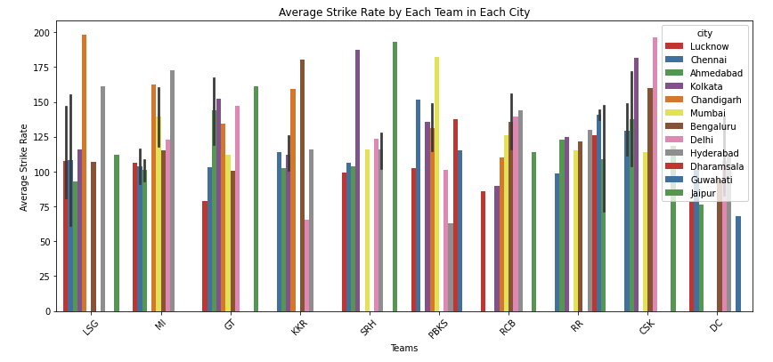
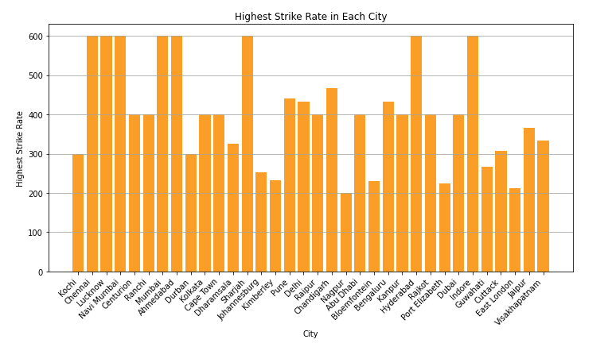

# IPL-cricket-data-analysis

## Project Overview
This project focuses on analyzing IPL (Indian Premier League) data to extract valuable insights and patterns. The dataset, sourced from Kaggle and stored in AWS S3, was imported into Databricks for transformation using Apache Spark, followed by detailed visualizations using Matplotlib and Seaborn.

## Objectives
- Analyze IPL match, team, and player data to identify trends.
- Leverage cloud storage and distributed computing for scalable analysis.
- Visualize key insights using advanced data visualization techniques.
- Provide actionable insights for cricket enthusiasts, analysts, and teams.

## Tools and Technologies
- **Kaggle:** Source of IPL dataset.

- **AWS S3:** Cloud storage for the dataset.

- **Databricks:** Platform for importing and transforming data using Apache Spark.

- **PySpark:** For distributed data processing and transformations.

- **Matplotlib & Seaborn:** For creating data visualizations.

## Project Workflow

### 1. Data Acquisition
The IPL dataset was sourced from Kaggle, consisting of match, player, and performance data, and was downloaded in CSV format.

### 2. Data Storage
The dataset was stored in AWS S3 to enable cloud-based access and efficient management. A structured folder system was set up for easy retrieval and organization.

### 3. Data Import into PySpark
The data was imported into a PySpark environment on Databricks for distributed data processing. PySpark’s DataFrame API was used to load the data directly from S3.

### 4. Data Exploration
The data’s structure and schema were inspected, and missing or incorrect values were handled to ensure data quality. Initial checks were done to validate data types and contents.

### 5. Data Transformation
Various PySpark transformations were applied, including filtering, grouping, and aggregation. Complex operations like window functions and joins were used to analyze team and player performances. SQL queries were executed on PySpark views for additional flexibility.

### 6. Data Visualization
After transformation, the data was converted to Pandas DataFrames for visualization. Matplotlib and Seaborn were used to create plots showcasing key metrics like total runs and strike rates.

### 7. Refinement & Insights
Visualizations were iterated upon based on findings, with adjustments made to the transformation process as necessary. Insights such as team performance in different cities and standout strike rates were derived and visualized.

## Diagram: Pipeline Workflow

## Implementation Details

### 1. Data Acquisition
- **Sourced Data from Kaggle**: The IPL dataset was sourced from Kaggle, which contained comprehensive match, team, and player statistics.
- **Accessed CSV Files**: The dataset was available in CSV format, which was downloaded and prepared for further processing.

### 2. Data Storage
- **AWS S3**: The downloaded dataset was stored in Amazon S3 for easy accessibility and integration with Databricks.
- **Organized Data**: A well-structured folder hierarchy was created in S3 to organize the data, making it easier to manage multiple files and datasets.

### 3. Data Import into PySpark
- **PySpark Environment in Databricks**: The data was imported into a PySpark environment using Databricks for distributed data processing.
- **Read Data**: PySpark’s DataFrame API was used to read the CSV files from S3 for further transformation and analysis.

### 4. Data Exploration
- **Check Structure and Schema**: Initial exploration of the dataset was conducted using functions like `show()`, `printSchema()`, and `describe()` to understand the structure and identify data types.
- **Handle Missing or Incorrect Data**: Missing values were handled by either dropping rows or replacing nulls, and any incorrect data was corrected during the exploration phase.

### 5. Data Transformation
- **Filtering, Grouping, Aggregation**: PySpark was used to filter data based on conditions, group data by teams and cities, and aggregate results (e.g., total runs, average strike rate).
- **Window Functions & Ordering**: Window functions were applied to rank or order the data, such as finding the highest strike rates.
- **SQL Views & Queries**: Temporary views were created to allow for traditional SQL queries on the data, making transformations easier using familiar SQL syntax.
- **Column Manipulation & Joins**: New columns were created, and multiple datasets were joined to enrich the data for deeper analysis.

### 6. Data Visualization
- **Export Data for Visualization**: The transformed PySpark DataFrame was converted to Pandas for easy visualization.
- **Matplotlib & Seaborn**: Using these libraries, various plots were created to visually represent the findings, such as bar plots and line graphs for team performance and strike rates.

### 7. Refinement and Insights
- **Review and Iterate**: The visualizations were reviewed to extract insights, and the transformation logic was adjusted iteratively to ensure the accuracy and clarity of the analysis.

### 8. Findings
- **Total Runs**: The total runs scored by each team in different cities during the 2023 IPL season were visualized, showing which teams performed well in various venues.
- **Average Strike Rate**: The average strike rate for each team in different cities was analyzed, providing insights into the most consistent batting teams across venues.
- **Highest Strike Rate**: A visualization was created to highlight the players and teams with the highest strike rate in each city, emphasizing exceptional performances.

All related files are in the [script](./scripts) folder.

## Conclusion
This project effectively demonstrates how large datasets, such as IPL cricket data, can be efficiently processed and analyzed using modern cloud platforms and distributed computing tools. The visual insights generated provide meaningful information that can be leveraged by cricket analysts, teams, and fans alike.

## Credits
Data Source: Kaggle (IPL dataset) https://www.kaggle.com/datasets/rajsengo/indian-premier-league-ipl-all-seasons/data

Thanks to DarshilParmar Youtube channel for sharing his knowledge!

Tools: Databricks, Apache Spark, AWS S3, Matplotlib, Seaborn
